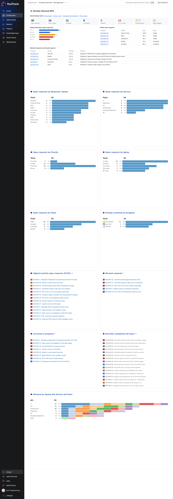
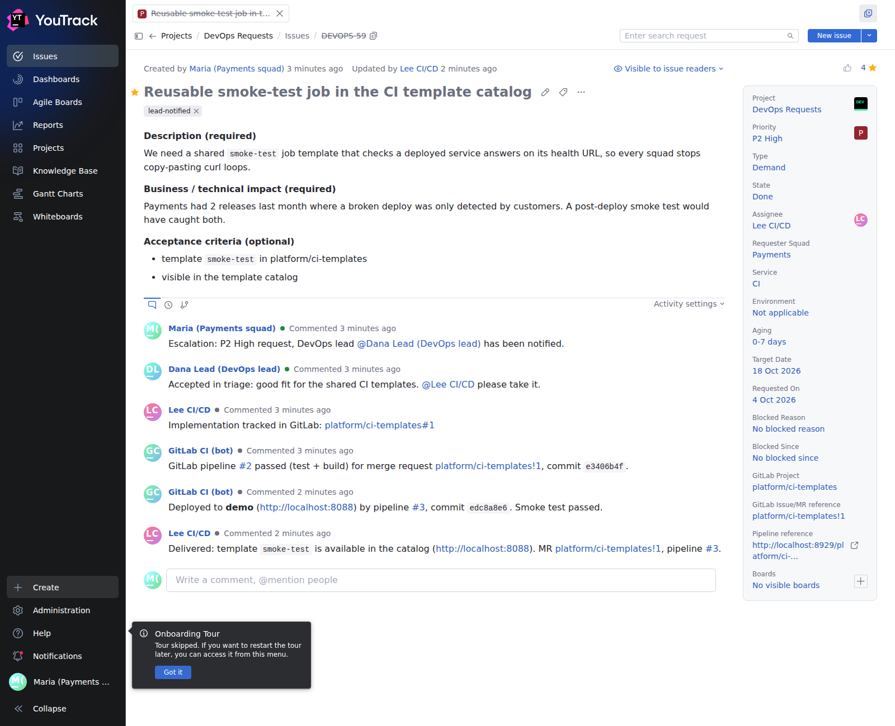
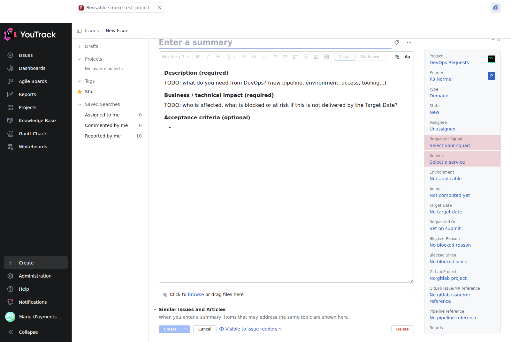
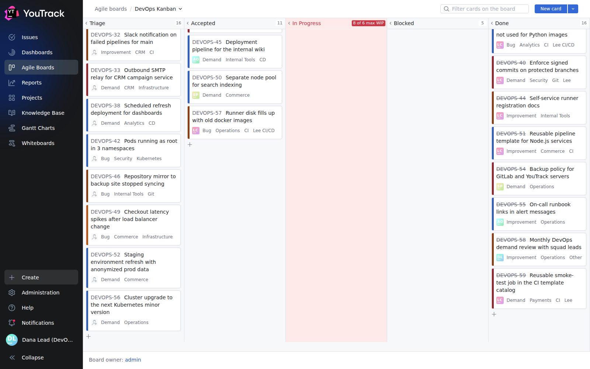
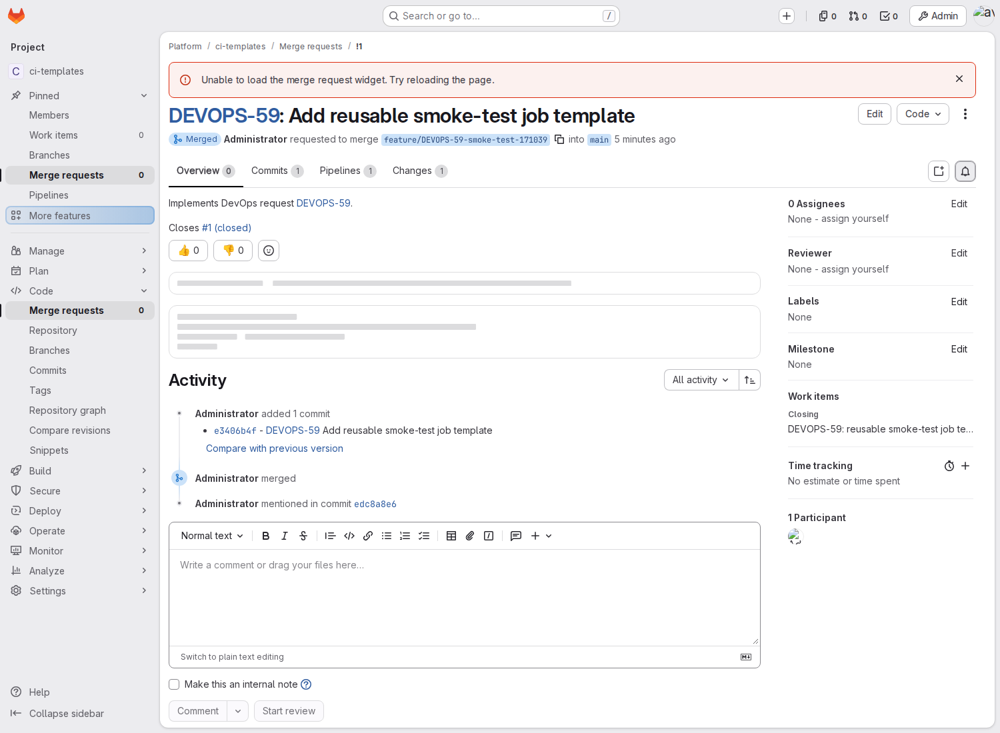
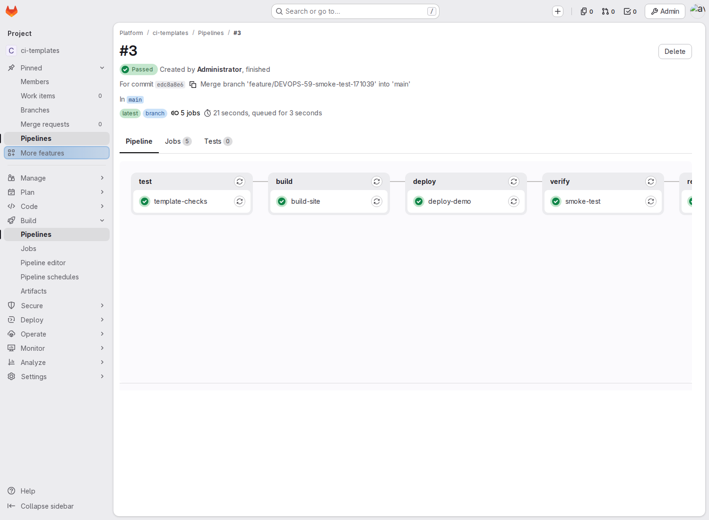
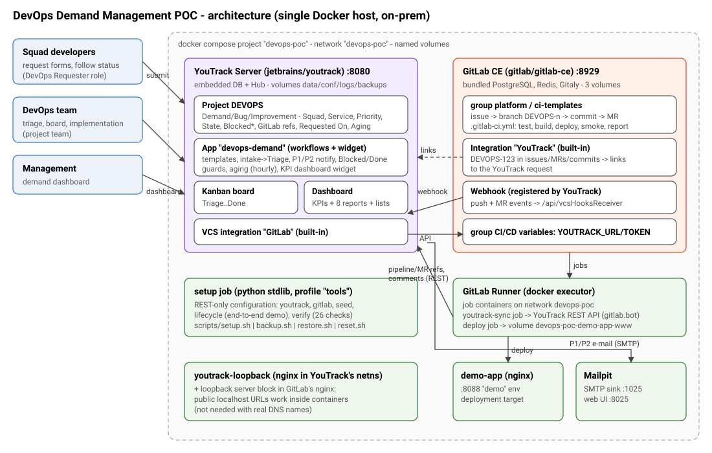
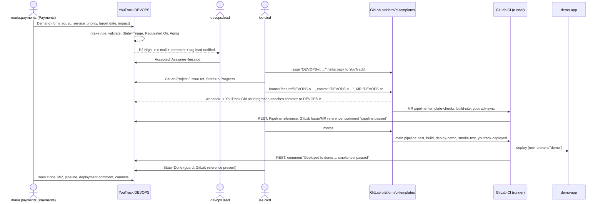

# DevOps Demand Management – POC (YouTrack Server + GitLab CE)

A runnable, on-premises proof of concept for a **central, lightweight DevOps demand process**:

```
Developer squad ─► YouTrack request ─► DevOps triage ─► Accepted / Rejected
   ─► DevOps implementation ─► GitLab issue / branch / MR / pipeline ─► Done
```

* **YouTrack Server** is the single front door for demands, bugs and improvements (project `DEVOPS`),
  with request forms, light workflow automation, a Kanban board and a management dashboard.
* **GitLab CE** is where the work is implemented: issue, branch, commit, merge request, CI pipeline,
  deployment. Both tools are linked with their **built-in integrations** plus a small CI job that writes
  pipeline results back through YouTrack's REST API.
* Everything is reproducible from a clean checkout with one command, runs on one Docker host,
  and has no cloud dependency.

This is not an ITSM tool and not a custom ticketing app: it is configuration of two off-the-shelf
products, plus ~300 lines of YouTrack workflow JavaScript and a stdlib-only Python setup job that
talks to the documented REST APIs.

---

## Contents

1. [Quick start](#1-quick-start)
2. [Architecture](#2-architecture)
3. [Demo walkthrough (15 minutes)](#3-demo-walkthrough-15-minutes)
4. [YouTrack configuration](#4-youtrack-configuration)
5. [GitLab integration](#5-gitlab-integration)
6. [Demo data](#6-demo-data)
7. [Operations: configuration, backup/restore, reset](#7-operations)
8. [Manual steps](#8-manual-steps)
9. [Free tier vs. paid features](#9-free-tier-vs-paid-features)
10. [What is proven / what remains to validate](#10-what-is-proven--what-remains-to-validate)
11. [Productionization recommendations](#11-productionization-recommendations)
12. [Repository layout](#12-repository-layout) · [Troubleshooting](#13-troubleshooting)

---

## 1. Quick start

**Requirements:** a Linux host (or Docker Desktop) with Docker Engine 24+ and the Compose v2 plugin,
4 CPU, **8 GB RAM** (GitLab ≈ 4 GB, YouTrack ≈ 2 GB), ~30 GB free disk, internet access to Docker Hub
for the first image pull. Free ports: 8080 (YouTrack), 8929 + 2224 (GitLab), 8025 (Mailpit), 8088 (demo app).

```bash
git clone <this repo> devops-demand-poc && cd devops-demand-poc
cp .env.example .env          # optional: review passwords/ports (setup.sh does this if missing)
./scripts/setup.sh            # ~15-20 min on first run (image pull + GitLab first boot)
```

`setup.sh` is idempotent and performs, in order:

| Step | What it does |
|---|---|
| `up.sh` | `docker compose up -d`, waits for YouTrack and GitLab health checks |
| `gitlab-token.sh` | creates the GitLab root API token with `gitlab-rails runner` (GitLab's documented method) |
| `youtrack` | admin token + password, users/groups/roles, project `DEVOPS`, fields, workflow app, board, saved searches, reports, dashboard, request guide article, scheduled backups, SMTP |
| `gitlab` | instance settings, group `platform` + projects, demo code + `.gitlab-ci.yml`, runner registration, YouTrack↔GitLab integrations, CI/CD variables |
| `seed` | 58 realistic requests from 10 squads, created through the real workflow |
| `lifecycle` | **end-to-end demo**: request → triage → GitLab issue → branch → commit → MR → MR pipeline → merge → deploy → smoke test → Done |
| `verify` | 26 acceptance checks, printed as a PASS/FAIL table (also in `.state/verify.txt`) |

Any single step can be re-run: `./scripts/setup.sh lifecycle`, `./scripts/setup.sh verify`, …

### URLs and logins (defaults from `.env.example`)

| What | URL | Login |
|---|---|---|
| YouTrack | http://localhost:8080 | `admin` / `YOUTRACK_ADMIN_PASSWORD` |
| Request guide (forms) | printed by `setup.sh` (Knowledge Base article *How to request DevOps help*) | any user |
| Management dashboard | YouTrack → Dashboards → **DevOps Demand - Management** | `eng.manager` |
| Kanban board | YouTrack → Agile Boards → **DevOps Kanban** | `devops.lead` |
| GitLab | http://localhost:8929 (project `platform/ci-templates`) | `root` / `GITLAB_ROOT_PASSWORD` |
| Demo deployment ("demo" environment) | http://localhost:8088 | – |
| Mailpit (e-mails sent by YouTrack) | http://localhost:8025 | – |

Demo users (password `YOUTRACK_DEMO_USER_PASSWORD`, default `Demo-Pass-2026!`):

| Login | Persona | Access |
|---|---|---|
| `maria.payments`, `tom.mobile` | squad developers (Payments, Mobile) | **DevOps Requester** role: create, read, comment, attach – cannot change workflow fields |
| `eng.manager` | engineering management | DevOps Requester role (read everything + dashboard) |
| `devops.lead` | DevOps lead – notified about P1/P2 | project team (full update rights) |
| `alex.ops`, `sam.platform`, `lee.cicd` | DevOps engineers (assignable) | project team |
| `gitlab.bot` | account used by GitLab CI to write back | project team |

> The YouTrack free license covers 10 users; the POC uses 9 (incl. `admin` and the bot). See §9.

### Screenshots (from a clean install)

| | |
|---|---|
|  **Management dashboard** (`eng.manager`) |  **A delivered request as the requester sees it** – GitLab refs, CI comments, deployment |
|  **Demand form** – template inserted, required fields highlighted |  **DevOps Kanban** – WIP limit exceeded on *In Progress* is flagged |
|  **GitLab MR** – `DEVOPS-59` links to YouTrack |  **main pipeline** – test, build, deploy, smoke test, report |

---

## 2. Architecture



| Container | Image | Purpose | Persistent volumes |
|---|---|---|---|
| `youtrack` | `jetbrains/youtrack:2026.2.x` | demand system (embedded DB + embedded Hub auth) | `youtrack-data`, `-conf`, `-logs`, `-backups` |
| `gitlab` | `gitlab/gitlab-ce:19.4.x` | Git, issues, MRs, CI/CD (bundled PostgreSQL, Redis, Gitaly) | `gitlab-config`, `-data`, `-logs` |
| `gitlab-runner` | `gitlab/gitlab-runner:alpine-v19.4.x` | docker executor; job containers join network `devops-poc` | `gitlab-runner-config` |
| `demo-app` | `nginx` | stand-in deployment target ("demo" environment) | `devops-poc-demo-app-www` |
| `mailpit` | `axllent/mailpit` | SMTP sink to show workflow e-mails | `mailpit-data` |
| `youtrack-loopback` | `nginx` | shares YouTrack's network namespace so GitLab's *public* URL (`localhost:8929`) works from inside YouTrack (§5) | – |
| `setup` (profile `tools`) | `python:3.12-alpine` | one-shot configuration job – REST APIs only, stdlib only | – |

**Database note:** GitLab uses its bundled **PostgreSQL** (supported single-node install).
YouTrack Server does **not** support external databases – it always uses its embedded database
(backed up with its own backup feature, see §7).

### Request lifecycle (what `./scripts/setup.sh lifecycle` executes)



---

## 3. Demo walkthrough (15 minutes)

Log in with different users in separate browser profiles (or private windows).

**A. Developer – submit a request in under 2 minutes** (`maria.payments`)
1. Open the dashboard (or the KB article *How to request DevOps help*) and click **New demand**
   (also: *Report a bug*, *Suggest an improvement*). The link opens YouTrack's standard create form
   with **Type** pre-set; the workflow inserts the matching **template** into the description.
2. Fill in *Summary*, *Requester Squad* and *Service* (highlighted as required), *Priority*,
   *Target Date* and replace the `TODO:` lines. Click **Create**.
3. Try leaving a `TODO:` or the Target Date empty: YouTrack refuses with an explicit message
   (e.g. *"A Demand needs a Target Date."*).
4. The request is now in **Triage**. *My requests* (link in the widget / saved search) shows its status;
   e-mail notifications arrive on every change (Mailpit).

**B. DevOps team – triage, prioritise, assign, block, link, deliver** (`devops.lead`, `lee.cicd`)
1. **DevOps Kanban**: columns Triage → Accepted → In Progress → Blocked → Done, cards coloured by
   priority, WIP limit 6 on *In Progress*. Filter with the board search box, e.g.
   `{Requester Squad}: Payments`, `Service: Kubernetes`, `Priority: {P1 Critical}`, `Assignee: me`
   (or click a value on a card). Saved searches: *DevOps: Triage queue*, *P1/P2 open*, *Blocked*, …
2. Drag a card from Triage to Accepted, set the Assignee. Raise a priority to P1/P2 → the lead gets an e-mail.
3. Drag a card to **Blocked** → refused until *Blocked Reason* is set. Easier: issue menu
   **⋯ → Mark as blocked** (or command `block waiting for firewall change FW-1182`). *Blocked Since* is recorded.
   Move it back to In Progress → a comment records how long it was blocked and why; the fields are cleared.
4. Try **Done** on a request without *GitLab Issue/MR reference* → refused (unless tagged `no-code-change`).
5. Open the request created by the lifecycle demo (dashboard → *Recently completed*): GitLab fields,
   comments from `gitlab.bot` (pipeline, deployment), **VCS changes** (commits attached by YouTrack's GitLab integration).

**C. Management – one dashboard** (`eng.manager`) → **DevOps Demand - Management**

| Question | Where on the dashboard |
|---|---|
| 1. Who is requesting work? | *Open requests by Requester Squad*, *Demand by Squad and Service (all time)* |
| 2. How much work comes from each squad? | same, with counts and % |
| 3. What is DevOps working on now? | KPI tiles *Accepted / In Progress*, list *Currently in progress*, *DevOps workload by Assignee* |
| 4. What is blocked? | KPI tile *Blocked*, table *Blocked requests and blocked age* (reason, days blocked), list *Blocked requests* |
| 5. How long have requests been waiting? | *Avg age*, *Aging (tagged)*, *Aging distribution*, *Oldest open requests*, report *Open requests by Aging* |
| 6. Highest-priority requests? | KPI *P1/P2 open*, list *Highest priority open requests*, report *by Priority* |

Every KPI tile is a link to the matching issue search.

**D. GitLab side** (`root`): project `platform/ci-templates` → merge requests and issues titled
`DEVOPS-n: …` (the ID is a link to YouTrack thanks to GitLab's YouTrack integration), pipelines
with `deploy-demo` / `smoke-test`, *Operate → Environments → demo*. http://localhost:8088 shows the
deployed catalog with the commit and linked request.

---

## 4. YouTrack configuration

All of it is created by `setup/ytsetup/youtrack.py` (REST API) and the app in `youtrack/app/devops-demand`.

### Project and fields (`DEVOPS`)

| Field | Type | Values / notes | Required |
|---|---|---|---|
| Type | enum | Demand, Bug, Improvement | yes |
| Requester Squad | enum | Payments, Customer Portal, Mobile, Data, CRM, Analytics, Security, Internal Tools, Commerce, Operations – **a field, not projects**; edit the values in *Project → Fields* | yes |
| Service | enum | CI, CD, Git, Kubernetes, Infrastructure, Developer Experience, Other | yes |
| Priority | enum | P1 Critical, P2 High, P3 Normal (default), P4 Low | yes |
| State | state | New, Triage, Accepted, In Progress, Blocked, Done (resolved), Rejected (resolved) | yes |
| Assignee | user | members of group *DevOps Team* | – |
| Target Date | date | required for Demands (workflow) | – |
| Requested On | date | set on submit; age is computed from it (the DevOps team may backdate it for migrated backlog) | auto |
| Environment | enum | Development, Test, Staging, Production – required for Bugs (workflow) | – |
| Blocked Reason / Blocked Since | string / date-time | maintained by the workflow | auto |
| GitLab Project / GitLab Issue/MR reference / Pipeline reference | string | filled by engineers and by the CI write-back job | – |
| Aging | enum | 0-7, 8-14, 15-30, 31-60, 60+ days – computed hourly | auto |

Tags: `aging` (over threshold), `lead-notified` (P1/P2 escalated), `no-code-change` (Done without GitLab work).

### Request forms / templates

Requests use YouTrack's own create form – no separate portal:

* **Pre-filled links** `/newIssue?project=DEVOPS&c=Type%20Demand` (`Bug`, `Improvement`) are published in the
  KB article *How to request DevOps help* (`youtrack/request-guide.md`) and at the top of the dashboard widget.
* Rule `request-templates` inserts the type's template into the draft description:
  * **Demand** – Description, Business / technical impact, (Acceptance criteria) + field Target Date
  * **Bug** – Description, Expected behavior, Actual behavior, Evidence (+ attachments) + field Environment
  * **Improvement** – Description, Expected benefit
* Mandatory information is enforced twice: required fields (*Type, Requester Squad, Service, Priority*)
  and rule `request-intake` (type-specific fields + every `(required)` section filled, no `TODO:` left).

### Workflow rules (app `devops-demand`, `youtrack/app/devops-demand/*.js`)

| Rule | Trigger | Behaviour |
|---|---|---|
| `request-templates` | draft, Type set | insert the description template (never overwrites user text) |
| `request-intake` | request submitted | validate (above); **State → Triage** (only the DevOps team may file directly in another state); set *Requested On*; compute *Aging* |
| `priority-escalation` | submitted as P1/P2, or raised to P1/P2 | e-mail to the DevOps lead (`user.notify`), comment, tag `lead-notified` |
| `blocked-enter` | State → Blocked | requires *Blocked Reason*; sets *Blocked Since* |
| `mark-blocked` | action *Mark as blocked* / command `block <reason>` | asks for the reason and blocks in one step |
| `blocked-leave` | Blocked → any other state | comment "Unblocked after N days. Blocked reason was …"; clears both fields |
| `done-guard` | State → Done | requires *GitLab Issue/MR reference* unless tag `no-code-change` |
| `aging-schedule` | hourly | recompute *Aging*; tag/untag `aging` above the threshold |
| `aging-refresh` | command `refresh-aging` | same, on demand |

Settings (Administration → Apps → *DevOps Demand Management* → Settings): **Aging threshold (days)**
(default from `AGING_THRESHOLD_DAYS`) and **DevOps lead login** (from `DEVOPS_LEAD_LOGIN`).

### Board, searches, reports, dashboard

* Agile board **DevOps Kanban** (no sprints; board query = open requests + Done in last 30 days),
  colour by Priority, cards show Type, Squad, Service, Assignee, Target Date.
* Saved searches (shared): Triage queue, P1/P2 open, Blocked, Aging, In progress, Recently completed,
  Unassigned accepted work, My requests, a per-squad example.
* Reports (shared): open requests by Squad / Service / Priority / Aging / State, workload by Assignee,
  matrix Squad × Service (all time), Squad × Type (90 days).
* Dashboard **DevOps Demand - Management**: the app's **KPI widget** (open, new/triage, accepted,
  in progress, blocked, P1/P2, average age, aging count, aging distribution, oldest requests, blocked
  table with blocked age) + 6 report widgets + 4 issue lists + the squad × service matrix.
  The KPI widget exists because YouTrack has no built-in "average age" / "blocked age" widget.

---

## 5. GitLab integration

Three documented mechanisms, no custom synchronisation protocol:

1. **YouTrack → GitLab: YouTrack's built-in GitLab VCS integration** (Project settings → Version Control).
   YouTrack registers a webhook in the GitLab project and attaches every commit / merge request whose
   message, branch or title contains `DEVOPS-<n>` to the request (*VCS changes*). Commands in commit
   messages (e.g. `DEVOPS-12 #In Progress`) are also supported by this integration.
2. **GitLab → YouTrack links: GitLab's built-in "YouTrack" integration** (Settings → Integrations).
   `DEVOPS-12` in GitLab issues, MRs and commits is rendered as a link to the YouTrack request.
3. **CI write-back via YouTrack's REST API**: the `youtrack-sync` / `youtrack-deployed` jobs
   (`gitlab/ci-templates/scripts/youtrack-sync.sh`, busybox `wget` only) set *GitLab Project*,
   *GitLab Issue/MR reference*, *Pipeline reference* and comment "pipeline passed" / "deployed to demo".
   The token belongs to `gitlab.bot` and is stored as a masked **group CI/CD variable**.

Conventions for engineers: put the request ID in the **branch** (`feature/DEVOPS-12-…`),
**commit message** (`DEVOPS-12 Add …`) and **MR title** (`DEVOPS-12: …`). The GitLab *issue* is optional
(the demo creates one to show the full chain); for small changes the MR alone is enough.

**Localhost note.** With the default `localhost` URLs, each container must reach the *other* product
through the URL users see in the browser: YouTrack registers its webhook as `http://localhost:8080/…`
and stores commit links as `http://localhost:8929/…`. Two loopback proxies make that work
(an nginx server block in GitLab's bundled nginx – `GITLAB_OMNIBUS_CONFIG` – and the `youtrack-loopback`
sidecar). With real DNS names (production) they are unnecessary.

---

## 6. Demo data

`setup/ytsetup/demo_data.py` – 58 requests created through the REST API so all rules run, then moved
through the workflow by the DevOps lead (`seed.py`):

* 10 squads (Payments has the most demand – visibly "overloading" CI/CD), 7 services
* 29 demands, 15 bugs, 14 improvements; 5 P1, 14 P2, 28 P3, 11 P4
* 16 in Triage, 11 Accepted, 8 In Progress, 5 Blocked (with reasons, blocked 6-25 days),
  15 Done (with GitLab references or `no-code-change`), 3 Rejected (with explanation)
* ages from 0 to 105 days → 22 requests flagged `aging` with the default 14-day threshold

YouTrack's REST API cannot backdate an issue's creation time, so the original request date of this
"migrated backlog" is stored in **Requested On** (the field the aging logic uses; on new requests the
workflow sets it to the submission time). Similarly *Blocked Since* is backdated for blocked items.
*Resolved* dates of seeded Done items are the seeding time.

---

## 7. Operations

### Configuration (`.env`)

| Variable | Default | Meaning |
|---|---|---|
| `YOUTRACK_VERSION`, `GITLAB_VERSION`, `GITLAB_RUNNER_VERSION`, … | pinned | image versions |
| `YOUTRACK_PORT`, `YOUTRACK_BASE_URL` | 8080, http://localhost:8080 | URL users open |
| `YOUTRACK_ADMIN_PASSWORD` | ChangeMe-YT-Admin1! | replaces the built-in `admin/admin` on first setup |
| `YOUTRACK_DEMO_USER_PASSWORD` | Demo-Pass-2026! | password of all demo users |
| `YOUTRACK_PROJECT_KEY` | DEVOPS | request ID prefix |
| `AGING_THRESHOLD_DAYS` | 14 | default of the app setting |
| `DEVOPS_LEAD_LOGIN` | devops.lead | who receives P1/P2 escalations |
| `GITLAB_HTTP_PORT`, `GITLAB_EXTERNAL_URL`, `GITLAB_SSH_PORT` | 8929, http://localhost:8929, 2224 | |
| `GITLAB_ROOT_PASSWORD` | Xq7-vNd2-Lp9w-Tz4k | GitLab rejects passwords containing "root" or common words |
| `GITLAB_ROOT_TOKEN` | glpat-devopspoc-… | API token created by `gitlab-token.sh` |
| `GITLAB_RUNNER_HELPER_IMAGE` | gitlab/gitlab-runner-helper:x86_64-v19.4.1 | Docker Hub mirror; point to an internal registry when air-gapped |
| `MAILPIT_UI_PORT`, `DEMO_APP_PORT` | 8025, 8088 | |

### Health checks

`docker compose ps` shows health for YouTrack (`/api/config`), GitLab (`/-/readiness?all=1`: Rails,
DB, Redis, Gitaly), demo-app and Mailpit. `./scripts/setup.sh verify` runs the functional checks.

### Backup and restore

```bash
./scripts/backup.sh                      # -> backups/<timestamp>/
./scripts/restore.sh backups/<timestamp> # same image versions
```

* YouTrack: database backup through the REST API (same as *Administration → Database Backup*);
  setup also enables the built-in **daily backup at 02:00, keeping 7 archives** (volume `youtrack-backups`).
  Restore = stop YouTrack, replace the database directories (`youtrack/`, `hub/`, `conf/` in the data
  volume) with the archive content, fix ownership (uid 13001), start.
* GitLab: `gitlab-backup create` + `gitlab-secrets.json` + `gitlab.rb`; restore with `gitlab-backup restore`
  (GitLab's documented procedure).
* POC state: `.env`, `.state/` (API tokens), runner `config.toml`.

### Reset

`./scripts/reset.sh` (asks for confirmation) removes all containers, volumes and `.state/`.

---

## 8. Manual steps

**None are required** – `./scripts/setup.sh` performs the complete installation, configuration and
demonstration non-interactively. Optional / environment-specific steps:

1. **Review `.env`** (passwords, ports) before exposing the instance to other people.
2. **First login in YouTrack** shows an onboarding tour – click *Skip the tour*.
3. **Using real host names** (e.g. `https://youtrack.example.com`): set `YOUTRACK_BASE_URL`,
   `GITLAB_EXTERNAL_URL` (and put a TLS reverse proxy in front); the loopback helpers can then be removed.
4. **E-mail**: the POC sends to Mailpit. For real e-mail change *Administration → Global settings →
   Notifications* (SMTP) in YouTrack and `gitlab_rails['smtp_*']` in `GITLAB_OMNIBUS_CONFIG`.
5. **Adding a squad / service**: YouTrack → *DEVOPS → Settings → Fields → Requester Squad → add value*
   (or add it to `SQUADS` in `setup/ytsetup/youtrack.py` and re-run `./scripts/setup.sh youtrack`).
6. **Linking another GitLab repository** to DEVOPS: *YouTrack → DEVOPS → Settings → Version Control →
   New VCS integration → GitLab* (URL + token) and *GitLab project → Settings → Integrations → YouTrack*.
   `setup/ytsetup/gitlab.py` / `vcs.py` show the equivalent API calls for automation.

---

## 9. Free tier vs. paid features

| Capability used | Product / tier | Notes |
|---|---|---|
| Projects, custom fields, workflows/apps (JavaScript), agile boards, reports, dashboards, knowledge base, REST API, VCS integrations, e-mail notifications | **YouTrack Server – free license** | YouTrack Server is free for **up to 10 users** with all features; licensing is by user count, not by feature. Verified here: the license reports `YouTrack Default`, and a user created beyond the limit was **automatically banned** ("License limit exceeded"). |
| More than 10 YouTrack users (every developer who submits requests) | **YouTrack Server – paid subscription** | Required for real roll-out. Alternative to evaluate: YouTrack Helpdesk project, where *reporters* do not consume licenses (changes the request experience). |
| Issues, merge requests, CI/CD pipelines, environments, Runner, webhooks, group CI/CD variables, built-in *YouTrack* integration, `gitlab-backup` | **GitLab CE (Free)** | Nothing in the POC needs GitLab Premium/Ultimate. |
| Merge-request approval rules, protected-environment approvals, audit events, epics | GitLab Premium+ | Not used; only mentioned in demo request texts. |
| Database | GitLab: bundled PostgreSQL (CE). YouTrack: embedded DB only – external PostgreSQL is **not supported** by YouTrack Server. | |

---

## 10. What is proven / what remains to validate

**Proven by this POC** (automated in `./scripts/setup.sh verify`, 26 checks, from a clean checkout):

* One YouTrack project with the requested model; squads are field values, not projects.
* A developer submits a typed request through a pre-filled form; incomplete requests are refused with
  an explicit message; new requests land in **Triage** automatically (measured: < 1 s; the form takes
  well under 2 minutes).
* Requesters see the status of their requests (and its GitLab references, CI comments and commits)
  without being able to change workflow fields (custom *DevOps Requester* role).
* P1/P2 escalation e-mails reach the DevOps lead; Blocked requires a reason and records/clears blocked
  metadata; Done requires the GitLab reference; aging is flagged against a configurable threshold.
* Kanban board Triage → Done; management dashboard answering the six questions with 58 requests.
* The full chain **YouTrack request → GitLab issue → branch → commit → MR → MR pipeline → merge →
  deployment → smoke test → Done**, with GitLab references, pipeline link, CI comments and attached
  commits visible on the request – all through built-in integrations + documented REST APIs.
* Reproducible install from a clean checkout (`reset.sh` + `setup.sh`: ~12 min with images cached,
  exit 0, 26/26), idempotent re-runs, health checks, online backup **and a successful restore drill**.

**Remains to validate:**

* **Real users**: a usability test of the forms with developers (in the narrow layout the create form
  folds some fields under "Show more"; DevOps-only fields such as *Blocked Reason* are visible to
  requesters and could be hidden), notification volume, wording of templates.
* **Identity**: SSO/LDAP (YouTrack Hub auth modules, GitLab LDAP/OIDC) and group sync for the DevOps team.
* **Licensing and cost** for the real number of requesters (> 10 users), or the Helpdesk-project alternative.
* **Scale of the GitLab integration**: one YouTrack VCS integration per repository – automate it
  (API as in `vcs.py`) or limit it to the repositories DevOps owns; GitLab *instance-level*
  YouTrack integration for all projects.
* **Restore at scale**: `backup.sh` → `restore.sh` was drilled on the POC (canary issue and branch
  created after the backup disappeared, all 26 checks green afterwards) – repeat with production-size
  data and measure the restore time.
* **Migration** of the existing backlog (spreadsheets/e-mails) – mapping to *Requested On*, or a
  YouTrack import client if creation dates must be preserved.
* Operating model: triage cadence, SLA targets per priority, who maintains squads/services lists.
* Upgrade path for both products (pin + follow GitLab's required upgrade stops).

---

## 11. Productionization recommendations

1. **Hosts**: run GitLab and YouTrack on separate VMs (GitLab ≥ 4 vCPU / 8 GB; YouTrack 2 vCPU / 4 GB),
   runners on their own hosts. Do not share the Docker socket of a core service host with CI jobs.
2. **TLS + DNS**: reverse proxy (nginx/Traefik) with certificates, real names in `YOUTRACK_BASE_URL` /
   `GITLAB_EXTERNAL_URL`; remove the loopback helpers.
3. **Authentication**: SSO (LDAP/AD, SAML or OIDC) in both tools; groups *DevOps Team* / requesters
   synchronised from the directory; disable local sign-up (already done in GitLab).
4. **Secrets**: rotate all demo passwords/tokens; keep tokens in a vault or Docker secrets; give
   `gitlab.bot` a dedicated least-privilege role; mark `YOUTRACK_TOKEN` *protected* and expire tokens.
5. **Configuration as code**: keep this repository as the source of truth – the workflow app is deployed
   with the setup job (same API as the official `youtrack-app` CLI), field values and boards via the API.
   Review workflow changes through merge requests and deploy them from CI.
6. **Backups**: keep the built-in YouTrack schedule and add a `gitlab-backup` cron; copy archives and
   `gitlab-secrets.json` off-host; quarterly restore test.
7. **Monitoring**: scrape GitLab's Prometheus endpoints and YouTrack's health URL; alert on disk,
   backup age and runner availability.
8. **Upgrades**: pin versions (as here), test upgrades on a copy restored from backup, follow GitLab's
   upgrade path, take a YouTrack backup before each upgrade.
9. **Runners and images**: mirror the runner helper image and job images into an internal registry
   (air-gapped readiness), use autoscaling or dedicated runners per trust level.
10. **Process**: weekly triage, explicit SLA per priority (e.g. P1 triaged within 2 h), monthly demand
    review with squad leads using the dashboard, keep the workflow small – resist adding states.
11. **Licensing**: budget YouTrack Server users for all requesters, or validate the Helpdesk model.

---

## 12. Repository layout

```
docker-compose.yml          stack definition (pinned images, volumes, health checks)
.env.example                all configuration
scripts/                    setup.sh (all-in-one), up.sh, gitlab-token.sh, backup.sh, restore.sh, reset.sh
setup/ytsetup/              setup job (Python stdlib): youtrack.py, gitlab.py, vcs.py, seed.py,
                            demo_data.py, lifecycle.py, verify.py
youtrack/app/devops-demand/ YouTrack app: workflow rules (*.js), settings.json, KPI dashboard widget
youtrack/request-guide.md   knowledge-base article with the request form links
gitlab/ci-templates/        demo GitLab project: templates, tests, site, .gitlab-ci.yml, youtrack-sync.sh
deploy/loopback/            nginx config of the youtrack-loopback helper
docs/                       architecture diagram, screenshots, verification-output.txt (evidence)
```

## 13. Troubleshooting

| Symptom | Fix |
|---|---|
| `setup.sh` waits long for GitLab | first boot runs migrations (5-10 min). `docker compose logs -f gitlab` |
| GitLab "Could not create the default administrator account" | password rejected by GitLab's policy (contains "root"/common words) – change `GITLAB_ROOT_PASSWORD`, `./scripts/reset.sh`, re-run |
| CI job fails pulling `gitlab-runner-helper` | registry.gitlab.com not reachable – the POC already uses the Docker Hub mirror (`GITLAB_RUNNER_HELPER_IMAGE`); for air-gapped sites mirror it internally |
| YouTrack user shows as banned | more than 10 users – free license limit |
| Dashboard widgets show "Total 0" | reports are computed lazily – `./scripts/setup.sh verify` (recalculates) or open the report once |
| No P1/P2 e-mail yet | YouTrack sends notifications in batches (~1 min); check http://localhost:8025 |
